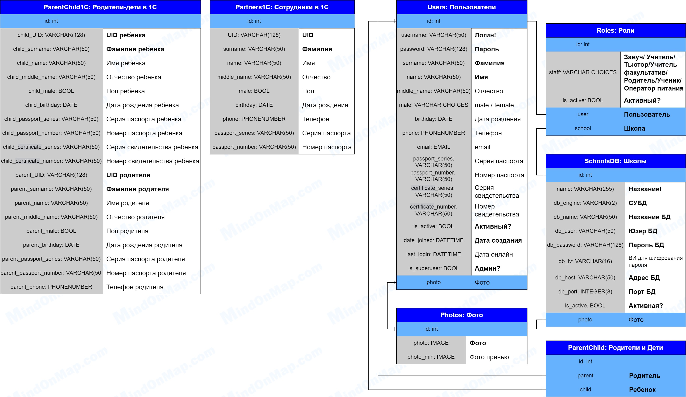

# Бэкенд проекта школ "Максимум"

---
## Развертывание проекта

1. Установить интерпретатор python 3.11 с менеджером пакетов PIP
2. Установить зависимости: из папки MAIN выполнить команду "pip install -r requirements.txt"
3. Настроить переменные окружения в файле MAIN/.env
4. Установить СУБД Postgres 15 и создать БД с названием как у SQL_DATABASE в файле MAIN/.env
5. Создать суперпользователя: из папки MAIN/MAIN_project выполнить команду "python manage.py createsuperuser"
6. Запустить проект: из папки MAIN/MAIN_project выполнить команду "python manage.py runserver". При необходимости можно указать нужный ip и порт: "python manage.py runserver 127.0.0.1:8000"

---
## Архитектура

- Реализация на языке программирования Python 3.11 с помощью фреймворка Django 4.2.7
- REST API
- Монолитная модульная архитектура
### Сервис MAIN:
- MAIN_project - конфигурация проекта и распределение роутов по модулям
- main_app - админка бэкенда, моделирование БД (пользователи, роли, фотографии, школы, родители-дети), сериализаторы, роуты
- token_app - авторизация через токены, создание и обновление access и refresh токенов
- oneC - получение / моделирование/ обработка данных с 1С - сотрудники, ученики и родители, ...
- media - локальное хранилище изображений и миниатюр
- static - папка со статичными файлами. Документирование openapi для swagger

## Cтруктура базы данных:
- Реализация с использованием СУБД PostgreSQL 15

### Сущности:

**Photos**
- Обязательные поля: photo

**Users**
- Уникальные поля: username
- Обязательные поля: username, password, name, surname, staff, is_active (True), date_joined (автоматически время создания), is_superuser (False)
  - Если staff = CO (Координатор) + email
  - Если staff = OP (Оператор) + email, department_id
- Связи: Photos

**SchoolsDB**
- Уникальные поля: name
- Обязательные поля: name, db_engine, db_name, db_user, db_password, db_host, db_port, is_active (True)
- Связи: Photos

**Roles**
- Обязательные поля: staff, is_active (True), user, school
- Связи: Users, SchoolsDB

**ParentChild**
- Обязательные поля: parent, child
- Связи: Users

**ParentChild1C**
- Обязательные поля: child_UID, child_surname, parent_UID, parent_surname

**Partners1C**
- Обязательные поля: UID, surname

---
## Роли пользователей, права доступа:

**1. Суперпользователь (is_superuser=True)**
- CREATE: всё
- READ: всё
- UPDATE: всё
- DELETE: всё

**2. Завуч ZAV**
- CREATE: фото, 
- READ: свой профиль, список пользователей школы, школы, свои дети, фото, 
- UPDATE:
- DELETE:
  
**3. Учитель TEA**
- CREATE: фото, 
- READ: свой профиль, школы, свои дети, фото, 
- UPDATE:
- DELETE:

**4. Тьютор TUT**
- CREATE: фото, 
- READ: свой профиль, школы, свои дети, фото, 
- UPDATE:
- DELETE:

**5. Учитель факультативов FAK**
- CREATE: фото, 
- READ: свой профиль, школы, свои дети, фото, 
- UPDATE:
- DELETE:

**6. Родитель PAR**
- CREATE: фото, 
- READ: свой профиль, школы, свои дети, фото, 
- UPDATE:
- DELETE:

**7. Ученик CHI**
- CREATE: фото, 
- READ: свой профиль, школы, свои дети, фото, 
- UPDATE:
- DELETE:

**8. Оператор питания EAT**
- CREATE: фото, 
- READ: свой профиль, школы, свои дети, фото, 
- UPDATE:
- DELETE:

---
## Маршруты и права доступа
- Openapi: 3.0.2
- /swagger/

### /token/create/
- POST: Создание токенов (все пользователи) 
### /token/refresh/
- POST: Обновление токенов (активные пользователи) 

---

### /whoami/
- GET: Получение информации пользователя по access токену (активные пользователи)
### /my-children/
- GET: Получение информации о детях пользователя по access токену (активные пользователи)
---
### /photo/
- POST: Добавление фотографии в локальное хранилище (активный пользователь)
### /photo/{id}/
- GET: Получение фотографии по id (активный пользователь)
### /photo-min/{id}/
- GET: Получение миниатюры фотографии по id (активный пользователь)

---

### /users/
- GET: Получение списка пользователей 
  - Суперпользователь - все пользователи 
  - Завуч - активные пользователи школы

---

### /schools/
- GET: Получение списка школ (активный пользователь) 
- POST: Создание школы (суперпользователь)
### /schools/{id}/
- GET: Получение школы (активный пользователь) 
- PATCH: Редактирование школы (суперпользователь)
- DELETE: Удаление школы (суперпользователь)

---

### /parent-childs/
- GET: Список всех связей Родитель-Дети (суперпользователь) 
- POST: Создание связи родитель-ребенок (суперпользователь)
- PATCH: Обновление связи родитель-ребенок (суперпользователь)
- DELETE: Удаление связи родитель-ребенок (суперпользователь)

---

### /roles/
- GET: Получение списка ролей (суперпользователь) 
- POST: Создание роли (суперпользователь)

---

### /1С/partners-get/
- GET: Список партнеров в 1С в зависимости от роли пользователя (суперпользователь, завуч)
### /1С/partners/
- POST: Добавление данных пользователей сотрудников из 1С (только у username='1C')
### /1С/users-get/
- GET: Список пар ученик-родитель в 1С в зависимости от роли пользователя (суперпользователь, завуч)
### /1С/partners/
- POST: Добавление данных ученик-родитель сотрудников из 1С (только у username='1C')

---